<div align="center">
  <a href="https://seunghwanly.github.io/seunghwanly/">
    
  </a>
</div>

<div align="center">
  <sub>위 궤도를 클릭하면 마우스와 터치에 반응하는 인터랙티브 프로필이 열립니다.</sub>
</div>

<br />

## 기술은 목적지가 아닌 궤도입니다

모바일 개발자로 시작해 Web, Backend, Infrastructure, Automation으로 작업 반경을 넓혀 왔습니다.
태양계의 중심은 언제나 **사용자 가치**. 기술은 문제에 맞춰 선택하고, 더 빠른 피드백 루프를 향해 공전합니다.

```dart
final seunghwan = Developer(
  startsFrom: Flutter.mobile,
  expandsTo: [Web, Backend, Infrastructure, AI],
  optimizesFor: [UserExperience, FastFeedback, ReliableDelivery],
);
```

### 지금 만드는 것

- Flutter와 React가 공존하는 점진적 마이그레이션
- 디자인 시스템과 개발 도구를 통한 반복 작업 자동화
- 관측 가능하고 다시 실행 가능한 모바일 CI/CD
- 실무에서 얻은 지식을 오픈소스와 교육으로 환원

### 공개 작업

| Project | Signal |
|:--|:--|
| [kakao_maps_flutter](https://github.com/seunghwanly/kakao_maps_flutter) | Kakao Maps SDK v2를 Flutter다운 API로 연결 |
| [widgetbook_size_inspector](https://github.com/seunghwanly/widgetbook_size_inspector) | Widgetbook에서 레이아웃 크기를 탐색하는 addon |
| [local-flutter-cicd-server](https://github.com/seunghwanly/local-flutter-cicd-server) | 반복 가능한 Flutter release/patch 자동화 |
| [dart-custom-lint-example](https://github.com/seunghwanly/dart-custom-lint-example) | 팀 규칙을 코드로 고정하는 custom lint 실험 |

<div align="center">
  <a href="https://github.com/seunghwanly?tab=repositories">Explore repositories</a>
  ·
  <a href="https://medium.com/@seunghwanly">Read notes</a>
  ·
  <a href="mailto:seunghwanly@gmail.com">Say hello</a>
</div>
